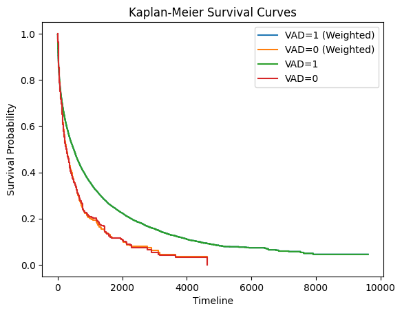
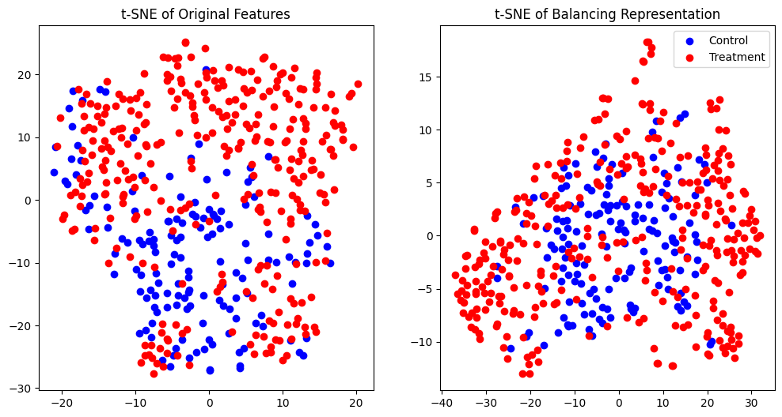
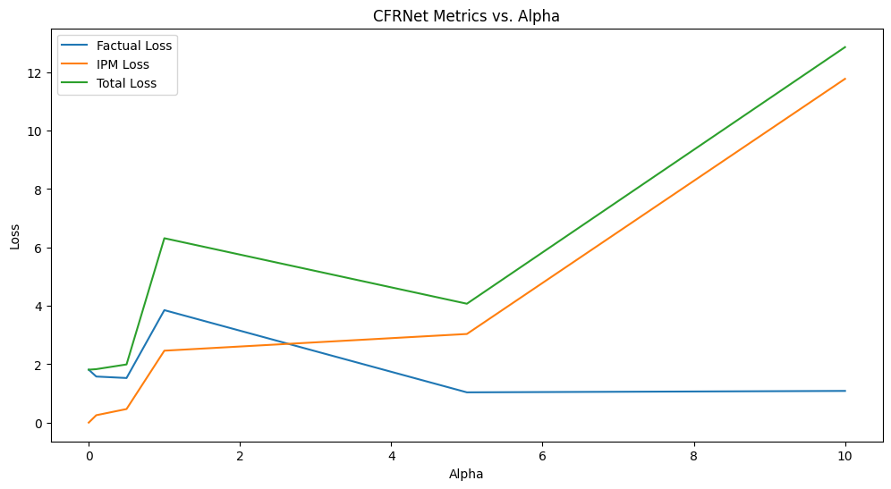

# Project 2: Machine Learning-based Causal Effect Estimation

Aaron Liu

---

## 2.1 Warm-up Exercise: Hypothesis Testing & Confounding [6 pts]

### Task 2.1.1 [1 pts]

**Task:** Implement the Log-Rank test from scratch in Python. Using the UNOS dataset, apply your implemented test to check whether the survival outcomes of patients on ventricular assist device (VAD) support differ from those of patients without VAD support.

**Results:**

- Test statistic: 7.642021036449715
- P-value: 2.1316282072803006e-14
- Conclusion: The small p-value supports that the two survival curves are different.

---

### Task 2.1.2 [1 pts]

**Task:** Propose a method to determine if there are confounders in the UNOS dataset for the effect of VAD support on survival outcomes. List all detected confounders.

**Method:** Confounders are variables that influence both the treatment and the outcome. I use logistic regression to identify variables that are important for predicting the treatment, and the Cox model to identify those that are important for predicting the outcome. Please find the implementation in the attached notebook.

**Detected confounders:**

- wgt_kg_tcr
- inotropic
- init_age
- iabp_tcr
- abo_O
- gender

---

### Task 2.1.3 [2 pts]

**Task:** Propose a propensity-weighted version of the Kaplan-Meier estimator that adjusts for confounding. Plot the propensity-weighted Kaplan-Meier curves in patients with and without VAD. Compare this plot with the survival curves of both groups using the standard Kaplan-Meier estimators.

**Propensity-weighted Kaplan-Meier estimator:**

I closely followed the method proposed by Xie and Liu (2005), and implemented the adjusted Kaplan-Meier estimator in Python. The estimator accounts for confounding by weighting each observation by the inverse of the propensity score. The implementation is provided below.

```python
class KaplanMeierEstimator:
    """Kaplan-Meier estimator for survival analysis.

    Attributes:
        survival_function_ (Dict[str, np.ndarray]): Dictionary with keys
            "time", "survival", "ci_lower", and "ci_upper" containing
            time points, survival probabilities, and confidence intervals.
        alpha (float): Significance level for confidence intervals.
    """

    def __init__(self, alpha: float = 0.05) -> None:
        self.alpha = alpha
        self.survival_function_ = None

    def fit(
        self,
        time: np.ndarray,
        event: np.ndarray,
        weights: Optional[np.ndarray] = None,
    ) -> None:
        """Fit the Kaplan-Meier estimator.

        Args:
            time (np.ndarray): Time points.
            event (np.ndarray): Event indicators.
            weights (Optional[np.ndarray], optional): Weights for each
                observation. Defaults to None.
        """
        if weights is None:
            weights = np.ones_like(time)

        # Sort data by time
        sorted_indices = np.argsort(time)
        sorted_time = time[sorted_indices]
        sorted_event = event[sorted_indices]
        sorted_weights = weights[sorted_indices]

        # Get unique times and their indices
        unique_times, indices = np.unique(sorted_time, return_inverse=True)

        # Calculate sum of weights and event counts per unique time
        sum_weights_per_time = np.bincount(
            indices, weights=sorted_weights, minlength=len(unique_times)
        )
        event_weights = sorted_event * sorted_weights
        event_counts = np.bincount(
            indices, weights=event_weights, minlength=len(unique_times)
        )

        # Compute number at risk (reverse cumulative sum of weights)
        n_at_risk = np.cumsum(sum_weights_per_time[::-1])[::-1]

        # Compute survival probabilities
        survival_probs = 1 - event_counts / n_at_risk
        survival_curve = np.cumprod(survival_probs)

        # Variance estimation
        with np.errstate(divide="ignore", invalid="ignore"):
            hazard_var_terms = event_counts / (
                n_at_risk * (n_at_risk - event_counts)
            )
        hazard_var_terms = np.nan_to_num(hazard_var_terms, nan=0.0)
        hazard_variance = np.cumsum(hazard_var_terms)

        survival_variance = survival_curve**2 * hazard_variance
        survival_std = np.sqrt(survival_variance)

        # Log-log transformation for confidence intervals
        epsilon = 1e-8  # Avoid log(0)
        survival_curve_clipped = np.clip(survival_curve, epsilon, 1 - epsilon)
        eta = np.log(-np.log(survival_curve_clipped))
        se_eta = survival_std / (
            survival_curve_clipped * np.abs(np.log(survival_curve_clipped))
        )

        z = scipy.stats.norm.ppf(1 - self.alpha / 2)

        # Confidence intervals
        eta_lower = eta - z * se_eta
        eta_upper = eta + z * se_eta
        ci_lower = np.exp(-np.exp(eta_upper))
        ci_upper = np.exp(-np.exp(eta_lower))

        # Store results
        if 0 not in unique_times:
            unique_times = np.concatenate([np.array([0]), unique_times])
            survival_curve = np.concatenate([np.array([1]), survival_curve])
            ci_lower = np.concatenate([np.array([1]), ci_lower])
            ci_upper = np.concatenate([np.array([1]), ci_upper])

        self.survival_function_ = {
            "time": unique_times,
            "survival": survival_curve,
            "ci_lower": ci_lower,
            "ci_upper": ci_upper,
        }

    def plot(self, **kwargs) -> None:
        """Plot the survival function with confidence intervals."""
        if self.survival_function_ is None:
            raise ValueError("Model has not been fitted yet.")

        draw_ci = kwargs.pop("ci", True)

        plt.step(
            self.survival_function_["time"],
            self.survival_function_["survival"],
            where="post",
            **kwargs,
        )
        if draw_ci:
            plt.fill_between(
                self.survival_function_["time"],
                self.survival_function_["ci_lower"],
                self.survival_function_["ci_upper"],
                alpha=0.3,
                step="post",
            )
        plt.xlabel("Timeline")
        plt.legend()

    def predict(self, time: np.ndarray) -> np.ndarray:
        """Predict survival probabilities for given time points."""
        return np.interp(
            time,
            self.survival_function_["time"],
            self.survival_function_["survival"],
        )
```

**Plot:**



**Comparison:**

The curves in treatment groups are roughly the same while those in control groups are slightly different

---

### Task 2.1.4 [2 pts]

**Task:** Propose a propensity-weighted version of the Log-Rank test. Apply this test to check whether the survival outcomes of patients on VAD support differ from those of patients without VAD. Compare the result of this test with the unadjusted test you implemented in Task 2.1.1.

**Propensity-weighted Log-Rank test:**

Same as the previous task, I closely followed the method proposed by Xie and Liu (2005) and implemented the adjusted Log-Rank test in Python. The test accounts for confounding through weighting each observation by their inverse propensity score. The implementation is provided below.

```python
def adjusted_logrank_test(
    time_a: np.ndarray,
    time_b: np.ndarray,
    event_a: np.ndarray,
    event_b: np.ndarray,
    weights_a: Optional[np.ndarray] = None,
    weights_b: Optional[np.ndarray] = None,
) -> Tuple[float, float]:
    """Adjusted logrank test for two groups.

    Args:
        time_a (np.ndarray): Times for group A.
        time_b (np.ndarray): Times for group B.
        event_a (np.ndarray): Event indicators for group A.
        event_b (np.ndarray): Event indicators for group B.
        weights_a (np.ndarray, optional): Weights (propensity scores)
            for group A.
        weights_b (np.ndarray, optional): Weights (propensity scores)
            for group B.

    Returns:
        Tuple[float, float]: Test statistic and p-value.

    References:
        J. Xie and C. Liu, “Adjusted Kaplan–Meier estimator and log‐rank
        test with inverse probability of treatment weighting for
        survival data,” Statistics in Medicine, vol. 24, no. 20, pp.
        3089–3110, Oct. 2005, doi: 10.1002/sim.2174.
    """
    # Default weights are all ones (standard logrank test)
    if weights_a is None:
        weights_a = np.ones_like(time_a)
    if weights_b is None:
        weights_b = np.ones_like(time_b)

    # Combine data
    times = np.concatenate((time_a, time_b))
    events = np.concatenate((event_a, event_b))
    groups = np.concatenate(
        (np.zeros(len(time_a)), np.ones(len(time_b)))
    )  # 0=A, 1=B
    weights = np.concatenate((weights_a, weights_b))

    # Unique event times where at least one event occurred
    event_times = np.unique(times[events == 1])
    event_times.sort()

    G_w = 0.0  # Weighted test statistic
    Var_w = 0.0  # Variance

    for t in event_times:
        # Unweighted quantities
        at_risk = times >= t
        Y_j = np.sum(at_risk)  # Total at risk (unweighted)
        at_time_t = (times == t) & (events == 1)
        d_j = np.sum(at_time_t)  # Total events (unweighted)

        if Y_j == 0:
            continue

        # Weighted quantities
        Y_j0_w = np.sum(weights[at_risk & (groups == 0)])  # Group A at risk
        Y_j1_w = np.sum(weights[at_risk & (groups == 1)])  # Group B at risk
        Y_j_w = Y_j0_w + Y_j1_w
        d_j1_w = np.sum(weights[at_time_t & (groups == 1)])  # Group B events
        d_j_w = np.sum(weights[at_time_t])  # Total weighted events

        # Test statistic contribution
        if Y_j_w > 0:
            E_j_w = Y_j1_w * d_j_w / Y_j_w
            G_w += d_j1_w - E_j_w

        # Variance contribution
        if Y_j > 1 and Y_j_w > 0:
            sum_var_j = (Y_j0_w / Y_j_w) ** 2 * np.sum(
                weights[at_risk & (groups == 1)] ** 2
            ) + (Y_j1_w / Y_j_w) ** 2 * np.sum(
                weights[at_risk & (groups == 0)] ** 2
            )
            V_j = (d_j * (Y_j - d_j) / (Y_j * (Y_j - 1))) * sum_var_j
        else:
            V_j = 0
        Var_w += V_j

    # Standardized statistic and p-value
    if Var_w > 0:
        Z = G_w / np.sqrt(Var_w)
        p_value = 2 * (1 - norm.cdf(np.abs(Z)))
    else:
        Z = 0
        p_value = 1.0

    return Z, p_value
```

**Results:**

- Unadjusted Log-Rank test:
  - Test statistic: 7.642021036449715
  - P-value: 2.1316282072803006e-14
- Adjusted Log-Rank test:
  - Test statistic: 5.933636448791616
  - P-value: 2.9629754205728887e-09

The adjusted test shows a smaller test statistic and a larger p-value, indicating a weaker evidence against the null hypothesis. However, both tests support that the survival curves are different. Patients on VAD support have better survival outcomes than those without VAD support.

---

## 2.2 ML-based Estimation of Average Treatment Effects [6 pts]

### Task 2.2.1 [1 pts]

**Task:** Estimate the average effect of aspirin and heparin on 14-day mortality using a standard difference-in-means estimator.

**Estimates:**

- Aspirin: -0.0333
- Heparin: -0.0072

**Estimates on the correct IST data:**

- Aspirin: -0.0039
- Heparin: -0.0030

**Comparison with original trial:** The estimates are quite different from the trial results, especially for aspirin.

---

### Task 2.2.2 [1 pts]

**Task:** Estimate the average effect using an inverse propensity weighting (IPW) estimator using a Gradient Boosting model for the propensity scores.

**Estimates:**

- Aspirin: -0.0076
- Heparin: -0.0049

**Comparison:** The estimates are closer to the trial results than the difference-in-means estimator.

---

### Task 2.2.3 [2 pts]

**Task:** Estimate the average effect using a covariate adjustment estimator using a Gradient Boosting model with T-learner, S-learner, and X-learner architectures.

**Estimates:**

- T-learner:
  - Aspirin: 0.0011
  - Heparin: -0.0058
- S-learner:
  - Aspirin: 0.0025
  - Heparin: -0.0018
- X-learner:
  - Aspirin: 0.0017
  - Heparin: -0.0067

---

### Task 2.2.4 [2 pts]

**Task:** Estimate the average effect using an augmented IPW (doubly-robust) estimator that combines the propensity model from Task 2.2.2 and an outcomes model based on the S-learner in Task 2.2.3.

**Estimates:**

- Aspirin: 0.0011
- Heparin: -0.0046

---

## 2.3 Counterfactual Inference and Domain Adaptation [8 pts]

### Task 2.3.1 [3 pts]

**Task:** Implement the TARNet and CFR_MMD models proposed in [3] in PyTorch. Evaluate the performance of all models using the semi-synthetic benchmark dataset included in the Project 2 notebook.

**Implementation summary:**

```python
class CFRNet(L.LightningModule):
    def __init__(
        self,
        input_dim: int = 25,
        rep_dim: int = 128,
        hidden_dim: int = 64,
        alpha: float = 1,
        lambda_reg: float = 1e-3,
        learning_rate: float = 1e-4,
    ) -> None:
        super().__init__()
        self.save_hyperparameters()

        # Representation network (Phi)
        self.phi = nn.Sequential(
            nn.Linear(input_dim, hidden_dim),
            nn.ReLU(),
            nn.Linear(hidden_dim, rep_dim),
            nn.ReLU(),
            nn.BatchNorm1d(rep_dim),
        )
        # Treated outcome network (h1)
        self.h1 = nn.Sequential(
            nn.Linear(rep_dim, hidden_dim), nn.ReLU(), nn.Linear(hidden_dim, 1)
        )
        # Control outcome network (h0)
        self.h0 = nn.Sequential(
            nn.Linear(rep_dim, hidden_dim), nn.ReLU(), nn.Linear(hidden_dim, 1)
        )

    def forward(
        self, x: torch.Tensor, t: torch.Tensor
    ) -> Tuple[torch.Tensor, torch.Tensor]:
        """Forward pass of the CFR model.

        Args:
            x (torch.Tensor): Input covariates of shape [batch_size, input_dim]
            t (torch.Tensor): Treatment assignments of shape [batch_size, 1], binary (0 or 1)

        Returns:
            y_pred (torch.Tensor): Predicted outcomes of shape [batch_size, 1]
            r (torch.Tensor): Representations of shape [batch_size, rep_dim]
        """
        r = self.phi(x)
        # Selects h1 or h0 based on t
        y_pred = t * self.h1(r) + (1 - t) * self.h0(r)
        return y_pred, r


    def configure_optimizers(self) -> torch.optim.Optimizer:
        params = [
            {
                "params": self.phi.parameters(),
                "weight_decay": 0.0,
            },  # No weight decay for Phi
            {
                "params": self.h1.parameters(),
                "weight_decay": 2 * self.hparams.lambda_reg,
            },
            {
                "params": self.h0.parameters(),
                "weight_decay": 2 * self.hparams.lambda_reg,
            },
        ]
        optimizer = torch.optim.Adam(
            params,
            lr=self.hparams.learning_rate,
        )
        return optimizer

    def training_step(
        self, batch: Dict[str, torch.Tensor], batch_idx: int
    ) -> torch.Tensor:
        x = batch["X"]
        t = batch["t"]
        y = batch["y"]
        u = batch["u"]

        y_pred, r = self(x, t)
        factual_loss = self.weighted_mse_loss(y_pred, y, t, u)
        ipm_loss = self.hparams.alpha * self.linear_mmd(r, t)
        loss = factual_loss + ipm_loss

        self.log(
            "train_factual",
            factual_loss,
            on_step=True,
            on_epoch=True,
            prog_bar=True,
        )
        self.log(
            "train_ipm",
            ipm_loss,
            on_step=True,
            on_epoch=True,
            prog_bar=True,
        )
        self.log(
            "train_loss",
            loss,
            on_step=True,
            on_epoch=True,
            prog_bar=True,
        )
        if "ite" in batch:
            ite = batch["ite"]
            ite_hat = self.predict_ite(x)
            sqrt_pehe = self.compute_sqrt_pehe(ite, ite_hat)

            self.log(
                "train_sqrt_pehe",
                sqrt_pehe,
                on_step=True,
                on_epoch=True,
                prog_bar=True,
            )

        return loss

    def validation_step(
        self, batch: Dict[str, torch.Tensor], batch_idx: int
    ) -> torch.Tensor:
        x = batch["X"]
        t = batch["t"]
        y = batch["y"]

        u = batch["u"]

        y_pred, r = self(x, t)
        factual_loss = self.weighted_mse_loss(y_pred, y, t, u)
        ipm_loss = self.hparams.alpha * self.linear_mmd(r, t)
        loss = factual_loss + ipm_loss

        self.log(
            "val_factual",
            factual_loss,
            on_step=False,
            on_epoch=True,
            prog_bar=True,
        )
        self.log(
            "val_ipm",
            ipm_loss,
            on_step=False,
            on_epoch=True,
            prog_bar=True,
        )
        self.log(
            "val_loss",
            loss,
            on_step=False,
            on_epoch=True,
            prog_bar=True,
        )

        if "ite" in batch:
            ite = batch["ite"]
            ite_hat = self.predict_ite(x)
            sqrt_pehe = self.compute_sqrt_pehe(ite, ite_hat)

            self.log(
                "val_sqrt_pehe",
                sqrt_pehe,
                on_step=False,
                on_epoch=True,
                prog_bar=True,
            )

        return loss

    def test_step(
        self, batch: Dict[str, torch.Tensor], batch_idx: int
    ) -> torch.Tensor:
        x = batch["X"]
        t = batch["t"]
        y = batch["y"]
        u = batch["u"]

        y_pred, r = self(x, t)
        factual_loss = self.weighted_mse_loss(y_pred, y, t, u)
        ipm_loss = self.hparams.alpha * self.linear_mmd(r, t)
        loss = factual_loss + ipm_loss

        self.log(
            "test_factual",
            factual_loss,
            on_step=False,
            on_epoch=True,
            prog_bar=True,
        )
        self.log(
            "test_ipm",
            ipm_loss,
            on_step=False,
            on_epoch=True,
            prog_bar=True,
        )
        self.log(
            "test_loss",
            loss,
            on_step=False,
            on_epoch=True,
            prog_bar=True,
        )
        if "ite" in batch:
            ite = batch["ite"]
            ite_hat = self.predict_ite(x)
            sqrt_pehe = self.compute_sqrt_pehe(ite, ite_hat)

            self.log(
                "test_sqrt_pehe",
                sqrt_pehe,
                on_step=True,
                on_epoch=True,
                prog_bar=True,
            )
        return loss

    def weighted_mse_loss(
        self,
        y_pred: torch.Tensor,
        y: torch.Tensor,
        t: torch.Tensor,
        u: float,
    ) -> torch.Tensor:
        """Compute the weighted mean squared error loss.

        Args:
            y_pred (torch.Tensor): Predicted outcomes [batch_size, 1]
            y (torch.Tensor): Observed outcomes [batch_size, 1]
            t (torch.Tensor): Treatment assignments [batch_size, 1]
            u (float): Proportion of treated units in the dataset

        Returns:
            torch.Tensor: Weighted MSE loss
        """
        weights = t / (2 * u) + (1 - t) / (2 * (1 - u))
        loss = (y_pred - y) ** 2
        weighted_loss = weights * loss

        return weighted_loss.mean()

    def linear_mmd(self, r: torch.Tensor, t: torch.Tensor) -> torch.Tensor:
        """Compute the squared linear MMD between treated and control representations.

        Args:
            r (torch.Tensor): Representations [batch_size, rep_dim]
            t (torch.Tensor): Treatment assignments [batch_size, 1]

        Returns:
            torch.Tensor: Linear MMD value
        """
        r_treated = r[t.squeeze() == 1]
        r_control = r[t.squeeze() == 0]
        # Handle empty groups
        if r_treated.size(0) == 0 or r_control.size(0) == 0:
            return torch.tensor(0.0, device=r.device)
        mean_treated = r_treated.mean(dim=0)
        mean_control = r_control.mean(dim=0)
        mmd = (mean_treated - mean_control).pow(2).sum()
        return mmd

    def predict_ite(self, x: torch.Tensor) -> torch.Tensor:
        """Predict individual treatment effects (ITE).

        Args:
            x (torch.Tensor): Input covariates of shape [batch_size, input_dim]

        Returns:
            torch.Tensor: Predicted ITE of shape [batch_size, 1]
        """
        r = self.phi(x)
        ite = self.h1(r) - self.h0(r)
        return ite

    def compute_ate(self, x: torch.Tensor) -> torch.Tensor:
        """Compute the Average Treatment Effect (ATE).

        Args:
            x (torch.Tensor): Input covariates of shape [batch_size, input_dim]

        Returns:
            torch.Tensor: Estimated ATE
        """
        ite = self.predict_ite(x)
        return ite.mean()

    def compute_sqrt_pehe(
        self,
        predicted_ite: torch.Tensor,
        ite: torch.Tensor,
    ) -> torch.Tensor:
        """Compute the Precision in Estimation of Heterogeneous Effects (PEHE).

        Args:
            predicted_ite (torch.Tensor): Predicted Individual Treatment Effects (ITEs)
            ite (torch.Tensor): True ITEs

        Returns:
            torch.Tensor: PEHE value
        """
        return torch.sqrt(((predicted_ite - ite) ** 2).mean())
```

**Performance metrics:**

- TARNet:
  - Square root of PEHE: 4.304728984832764
- CFR_MMD:
  - Square root of PEHE: 4.134998798370361

---

### Task 2.3.2 [1 pts]

**Task:** Visualize the treated and control features before and after applying the balancing representation Φ(.) using t-SNE. Comment on the results.

**t-SNE plot:**



**Commentary:**

With the help from the MMD regularizer, the representation network Φ(.) aligns the treated and control groups in the balanced representation space. The t-SNE plot shows that the treated and control groups are better separated in the original feature space, while they are more mixed in the balanced representation space.

---

### Task 2.3.3 [1 pts]

**Task:** Show the impact of the scaling parameter α (Eq. (3) in [3]) on the loss function on the test set for the Maximum Mean Discrepancy (MMD) regularizer.

**Impact of α:**



---

### Task 2.3.4 [3 pts]

**Task:** Use the TARNet and CFR_MMD models to estimate average treatment effects using the IST data in Task 2.2. Assess the alignment of your estimates with the trial results and compare them to the estimators in Tasks 2.2.3 and 2.2.4.

**Estimates:**

- TARNet:
  - Aspirin: -0.0285
  - Heparin: -0.0094
- CFR_MMD:
  - Aspirin: -0.0312
  - Heparin: -0.0033

**Comparison with trial results:**

The signs of the estimates are consistent with the trial results, but the magnitudes are different.

**Comparison with Tasks 2.2.3 and 2.2.4:**

The estimates on the heparin effect are similar to those meta-learners in Task 2.2.3 and 2.2.4, but the estimates on the aspirin effect are different. The CFR_MMD model provides the closest estimates to the trial results in heparin case.

---

## 2.4 NeurIPS Reviewer for a Day: Reviewing & Reproducing Recent Research on ML-Based Causal Inference [10 pts]

### Task 2.4.1 [5 pts]

**Task:** Review the NeurIPS 2024 reviewing guidelines and write a comprehensive review of the paper "Adapting Neural Networks for the Estimation of Treatment Effects" by Claudia Shi, David Blei, and Victor Veitch, in accordance with those guidelines.

**Review:**

This paper proposes innovative adaptations—Dragonnet, a novel neural network architecture, and targeted regularization—to enhance treatment effect estimation from observational data. Leveraging statistical insights, these methods aim to improve downstream causal estimates over traditional approaches. Evaluated on IHDP and ACIC 2018 datasets, the adaptations show superior performance, making a compelling case for their adoption in causal inference.

**Strengths**

1. Innovation:Dragonnet exploits propensity score sufficiency, while targeted regularization integrates non-parametric estimation theory, offering fresh perspectives on neural network design for causal tasks (Sections 2, 3).
2. Empirical Rigor: Experiments demonstrate significant improvements over baselines like TARNET, with mean absolute errors reduced (e.g., 0.35 vs. 1.45 on ACIC 2018, Table 2).

3. Theoretical Foundation: The paper ties its methods to established theory, providing intuition and partial proofs (Section 3).

**Weaknesses and Suggestions**

1. Limitations: The paper acknowledges the no-hidden-confounding assumption but could elaborate on robustness to assumption violations.
2. Statistical Clarity: Error bars are reported (Table 1), but calculation methods are unclear. Specifying this would bolster transparency.

Checklist Evaluation

- Claims: Yes (Abstract, Section 1 reflect scope).
- Limitations: Yes (Section 6).
- Theory: Yes (Section 3).
- Reproducibility: Yes (Section 5), needs more instructions.
- Open Access: Yes.
- Experimental Details: Yes (Section 5).
- Statistical Significance: Yes (Table 1), clarify error computation.
- Compute Resources: Yes (in acknowledgments), but unclear in the main text.
- Ethics: Yes.
- Broader Impacts: N/A.
- Safeguards: N/A.
- Licenses: Yes, but add details.
- Assets: N/A.
- Crowdsourcing: N/A.
- IRB: N/A.

Overall Assessment

This paper advances causal inference with robust methods and solid results. Minor enhancements in transparency and detail would elevate it further. I recommend acceptance.

---

### Task 2.4.2 [5 pts]

**Task:** Implement the DragonNet and Targeted regularization methods proposed in the paper in PyTorch and reproduce their performance results on the IHDP dataset (Table 1 in the paper).

**Implementation:**

```python
class Dragonnet(L.LightningModule):
    def __init__(
        self,
        input_dim,
        shared_hidden=200,
        outcome_hidden=100,
        alpha: float = 1.0,
        learning_rate: float = 1e-3,
    ):
        super().__init__()
        self.save_hyperparameters()

        # Shared representation layers: 3 layers with 200 units each
        self.shared_net = nn.Sequential(
            nn.Linear(input_dim, shared_hidden),
            nn.ReLU(),
            nn.Linear(shared_hidden, shared_hidden),
            nn.ReLU(),
            nn.Linear(shared_hidden, shared_hidden),
            nn.ReLU(),
        )

        # Propensity score head: linear layer followed by sigmoid
        self.propensity_head = nn.Linear(shared_hidden, 1)

        # Outcome head for T=0: 2 hidden layers with 100 units each
        self.outcome_head_0 = nn.Sequential(
            nn.Linear(shared_hidden, outcome_hidden),
            nn.ReLU(),
            nn.Linear(outcome_hidden, outcome_hidden),
            nn.ReLU(),
            nn.Linear(outcome_hidden, 1),
        )

        # Outcome head for T=1: 2 hidden layers with 100 units each
        self.outcome_head_1 = nn.Sequential(
            nn.Linear(shared_hidden, outcome_hidden),
            nn.ReLU(),
            nn.Linear(outcome_hidden, outcome_hidden),
            nn.ReLU(),
            nn.Linear(outcome_hidden, 1),
        )

    def forward(self, x):
        """Forward pass of Dragonnet.

        Args:
            x (torch.Tensor): Covariates tensor of shape (batch_size, input_dim)

        Returns:
            g (torch.Tensor): Propensity score predictions, shape (batch_size, 1)
            q0 (torch.Tensor): Outcome predictions for T=0, shape (batch_size, 1)
            q1 (torch.Tensor): Outcome predictions for T=1, shape (batch_size, 1)
        """
        # Compute shared representation Z(X)
        z = self.shared_net(x)

        # Propensity score prediction
        g = torch.sigmoid(self.propensity_head(z))

        # Outcome predictions
        q0 = self.outcome_head_0(z)
        q1 = self.outcome_head_1(z)

        return g, q0, q1

    def configure_optimizers(self):
        optimizer = torch.optim.Adam(
            self.parameters(),
            lr=self.hparams.learning_rate,
        )
        scheduler = {
            "scheduler": torch.optim.lr_scheduler.ReduceLROnPlateau(
                optimizer,
                mode="min",
                factor=0.5,
                patience=2,
            ),
            "monitor": "train_loss_epoch",
        }

        return [optimizer], [scheduler]

    def predict_ite(self, x: torch.Tensor) -> torch.Tensor:
        """Predict individual treatment effects (ITE).

        Args:
            x (torch.Tensor): Input covariates of shape [batch_size, input_dim]

        Returns:
            torch.Tensor: Predicted ITE of shape [batch_size, 1]
        """
        g, q0, q1 = self(x)
        ite = q1 - q0
        return ite

    def compute_ate(self, x: torch.Tensor) -> torch.Tensor:
        """Compute the Average Treatment Effect (ATE).

        Args:
            x (torch.Tensor): Input covariates of shape [batch_size, input_dim]

        Returns:
            torch.Tensor: Estimated ATE
        """
        ite = self.predict_ite(x)
        return ite.mean()

    def compute_ate_with_error(
        self, x: torch.Tensor, alpha=0.05
    ) -> Tuple[float, float]:
        """Compute the Average Treatment Effect (ATE) with confidence intervals.

        Args:
            x (torch.Tensor): Input covariates of shape [batch_size, input_dim]
            alpha (float): Confidence level

        Returns:
            Tuple[float, float]: Estimated ATE and margin of error
        """
        ite = self.predict_ite(x)
        ate = ite.mean()
        n = len(ite)
        se = ite.std() / np.sqrt(n)
        z = scipy.stats.norm.ppf(1 - alpha / 2)
        margin_of_error = z * se
        return ate, margin_of_error

    def training_step(self, batch, batch_idx):
        x, t, y = batch["X"], batch["t"], batch["y"]
        g, q0, q1 = self(x)

        loss = self.dragonnet_loss(y, t, g, q0, q1, self.hparams.alpha)
        self.log(
            "train_loss", loss, on_step=True, on_epoch=True, prog_bar=True
        )
        return loss

    def validation_step(self, batch, batch_idx):
        x, t, y = batch["X"], batch["t"], batch["y"]
        g, q0, q1 = self(x)

        loss = self.dragonnet_loss(y, t, g, q0, q1, self.hparams.alpha)
        self.log("val_loss", loss, on_step=False, on_epoch=True, prog_bar=True)
        return loss

    def dragonnet_loss(self, y, t, g, q0, q1, alpha=1.0):
        """Compute the Dragonnet loss function as per Equation 2.2 in the paper.

        Args:
            y (torch.Tensor): True outcomes, shape (batch_size, 1)
            t (torch.Tensor): Treatment assignments (0 or 1), shape (batch_size, 1)
            g (torch.Tensor): Predicted propensity scores, shape (batch_size, 1)
            q0 (torch.Tensor): Predicted outcomes for T=0, shape (batch_size, 1)
            q1 (torch.Tensor): Predicted outcomes for T=1, shape (batch_size, 1)
            alpha (float): Weight for propensity loss, default 1.0

        Returns:
            torch.Tensor: Total loss
        """
        # Select the predicted outcome based on the actual treatment
        q_pred = t * q1 + (1 - t) * q0  # Q^{nn}(t_i, x_i)

        # Outcome loss: mean squared error
        outcome_loss = F.mse_loss(q_pred, y)

        # Propensity loss: binary cross-entropy
        propensity_loss = F.binary_cross_entropy(g, t)

        # Total loss
        total_loss = outcome_loss + alpha * propensity_loss
        return total_loss
```

**Reproduced results:**

- Dragonnet:
  - Δin: 0.1494
  - Δout: 0.2409
  - Δall: 0.1410
- Dragonne + t-reg*:
  - Δin: 0.1047
  - Δout: 0.1580
  - Δall: 0.0393

*It is likely that the results are not exactly the same due to the random seed and other implementation details.

---

**References**

1. Weiss, Eric S., et al. "Outcomes in bicaval versus biatrial techniques in heart transplantation: an analysis of the UNOS database." *The Journal of Heart and Lung Transplantation*, vol. 27, no. 2, 2008, pp. 178-183.
2. International Stroke Trial Collaborative Group. "The International Stroke Trial (IST): a randomised trial of aspirin, subcutaneous heparin, both, or neither among 19435 patients with acute ischaemic stroke." *The Lancet*, vol. 349, no. 9065, 1997, pp. 1569-1581.
3. Shalit, U., Johansson, F. D., and D. Sontag. "Estimating individual treatment effect: generalization bounds and algorithms." *International Conference on Machine Learning*, 2017, pp. 3076-3085.
